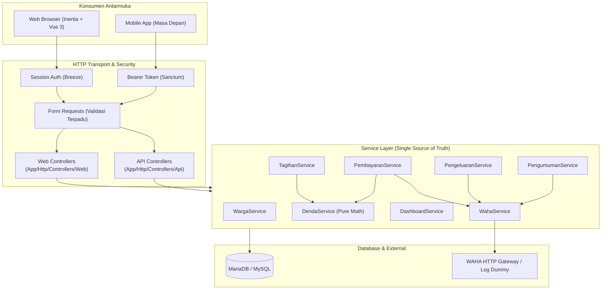

# VIWB: Arsitektur & Spesifikasi Sistem (Laravel + Inertia + Vue)

> Dokumen ini adalah dokumentasi arsitektur resmi dan spesifikasi teknis sistem **VIWB** (Sistem Manajemen Administrasi Perumahan). Seluruh isi dokumen ini mencerminkan kondisi implementasi aktual yang telah dibangun, berjalan di environment Docker, dan tervalidasi melalui test suite automated.

---

## 1. Ringkasan Sistem & Status Implementasi

**VIWB** adalah platform tata kelola lingkungan perumahan terpadu yang menangani master data warga, penagihan iuran berkala (Keamanan, Kebersihan, HIPPAM, Paguyuban), kalkulasi denda dinamis, verifikasi pembayaran warga, pembukuan kas/pengeluaran dengan sistem persetujuan (*approval flow*) berjenjang, publikasi pengumuman, serta integrasi broadcast notifikasi WhatsApp.

### Status Implementasi Aktual
- **Repository:** [github.com/projectsonlyindra/web-viwb](https://github.com/projectsonlyindra/web-viwb)
- **Status:** Implementasi penuh (*Feature-complete*), siap operasional (*Production-ready*).
- **Automated Tests:** **62 tests passed** (132 assertions) mencakup Unit Testing dan Feature Testing di seluruh modul bisnis.
- **Infrastruktur:** Mendukung Docker All-in-One container maupun Baremetal / Dedicated Host Linux.

---

## 2. Technology Stack Aktual

Berdasarkan implementasi nyata pada repositori:

| Layer | Teknologi & Versi | Peran / Keterangan |
|---|---|---|
| **Backend Framework** | **Laravel 13.31.0** (PHP 8.3-FPM) | Router, ORM (Eloquent), Service Layer, Policy Authorization, Console Scheduler |
| **Frontend Adapter** | **Inertia.js v2.0** (`@inertiajs/vue3`, `inertia-laravel`) | Monolith SPA tanpa REST API boilerplate untuk antarmuka web |
| **Frontend Framework**| **Vue 3.4** (Composition API, `<script setup>`) | Reaktifitas UI dashboard, dialog modal, filter interaktif |
| **Styling & UI Kit** | **Tailwind CSS v4** + **shadcn-vue** (`reka-ui`, `@lucide/vue`) | Desain UI modern, clean, responsif, dan konsisten |
| **REST API Layer** | **Laravel Sanctum 4.0** | Autentikasi berbasis token (`auth:sanctum`) disiapkan untuk konsumsi aplikasi mobile |
| **Database** | **MariaDB 10.11 / MySQL 8.x** | Database relasional dengan 15 migrasi terstruktur & foreign key integrity |
| **WhatsApp Engine** | **WAHA (WhatsApp HTTP API)** Client | HTTP client dengan otomatisasi fallback *Dummy Mode* saat development/testing |
| **Background Worker** | **Laravel Console Scheduler + Database Queue** | Pemrosesan antrean batch broadcast dan denda tanpa ketergantungan Redis |
| **Runtime Container** | **Docker & Docker Compose** (Debian Bookworm) | Image All-in-One memuat Nginx, PHP-FPM, MariaDB, Node.js 22, dan Supervisor |

---

## 3. Pola Arsitektur: Dual-Consumer Service Layer

Untuk mendukung dua antarmuka (Web Inertia.js saat ini dan Mobile Application di masa depan), seluruh logika bisnis diisolasi secara ketat pada **Service Layer** (`app/Services`).

Controller hanya bertindak sebagai *HTTP transport layer*:
- `App\Http\Controllers\Web\*`: Menerima input, memanggil Service, merender komponen Vue via `Inertia::render()` atau me-redirect dengan flash message.
- `App\Http\Controllers\Api\*`: Menerima input, memanggil Service yang sama, mengembalikan `response()->json()`.
- `App\Http\Requests\*`: Menjamin aturan validasi yang seragam di kedua kanal akses.



---

## 4. Struktur Direktori Proyek

```
web-viwb/
├── app/                              # Core Laravel backend
│   ├── Console/Commands/
│   │   ├── GenerateTagihanBulanan.php # Command: tagihan:generate {periode?}
│   │   └── ProcessBroadcastQueue.php  # Command: broadcast:process
│   ├── Enums/                        # 9 Native PHP Enums
│   ├── Http/
│   │   ├── Controllers/
│   │   │   ├── Api/                  # REST API Controllers (Sanctum)
│   │   │   ├── Auth/                 # Laravel Breeze Session Controllers
│   │   │   └── Web/                  # Inertia Web Controllers
│   │   ├── Middleware/
│   │   └── Requests/                 # Form Request Validasi Terpusat
│   ├── Models/                       # Eloquent Models
│   ├── Policies/                     # Granular Authorization Policies
│   └── Services/                     # Domain Business Logic Core
├── bootstrap/                        # Application bootstrap & provider loading
├── config/                           # Konfigurasi aplikasi
├── database/
│   ├── migrations/                   # 15 file migrasi skema database
│   └── seeders/                      # DatabaseSeeder & KonfigurasiLayananSeeder
├── docker/                           # Konfigurasi container runtime
│   ├── nginx.conf                    # Web server virtual host
│   ├── php.ini                       # Konfigurasi custom PHP 8.3
│   ├── supervisord.conf              # Supervisor daemon (Nginx, FPM, MariaDB, Scheduler)
│   └── start.sh                      # Bootstrap container & auto-sync rsync
├── docker-compose.yml                # Port forwarding 80:80 & persistent volumes
├── Dockerfile                        # Multi-service image (PHP 8.3, MariaDB, Node.js 22)
├── docs/                             # Dokumentasi proyek
│   ├── VIWB-ARCHITECTURE.md          # Dokumen arsitektur ini
│   ├── PANDUAN-PENGGUNAAN.md         # Panduan operasional pengguna & role
│   ├── PANDUAN-DEPLOYMENT-DAN-SSL.md # Panduan deployment produksi & SSL
│   └── PANDUAN-BAREMETAL.md          # Panduan instalasi tanpa Docker
├── public/                           # Web root publik
├── resources/
│   └── js/
│       ├── components/ui/            # Komponen shadcn-vue
│       ├── Pages/                    # Inertia Vue Views
│       └── Shared/                   # Layouts & reusable UI elements
├── routes/                           # Route definitions (web, api, auth, console)
├── storage/                          # Logs, sessions, dan framework cache
├── tests/                            # Unit & Feature automated test suites
├── artisan                           # Laravel CLI executable
├── composer.json                     # PHP package dependencies
└── package.json                      # Node.js frontend dependencies
```

---

## 5. Skema Database & Model Eloquent

Seluruh model Eloquent menggunakan fitur PHP 8.3 attribute `#[Fillable([...])]` dan `#[Hidden([...])]` dengan tipe *native casts* dan relasi integritas tinggi.

### 5.1 Tabel: `users`
Menyimpan kredensial login dan asosiasi hak akses sistem.
```sql
CREATE TABLE users (
    id BIGINT UNSIGNED AUTO_INCREMENT PRIMARY KEY,
    name VARCHAR(255) NOT NULL,
    email VARCHAR(255) UNIQUE NOT NULL,
    email_verified_at TIMESTAMP NULL,
    password VARCHAR(255) NOT NULL,
    role ENUM('SUPERADMIN', 'KETUA_RT', 'BENDAHARA', 'TIM_DIVISI', 'WARGA') NOT NULL,
    divisi ENUM('KEAMANAN', 'KEBERSIHAN', 'HIPPAM', 'PAGUYUBAN') NULL,
    warga_id BIGINT UNSIGNED NULL,
    remember_token VARCHAR(100) NULL,
    created_at TIMESTAMP NULL,
    updated_at TIMESTAMP NULL,
    FOREIGN KEY (warga_id) REFERENCES warga(id) ON DELETE SET NULL
);
```

### 5.2 Tabel: `warga`
Master data penduduk dan properti rumah perumahan.
```sql
CREATE TABLE warga (
    id BIGINT UNSIGNED AUTO_INCREMENT PRIMARY KEY,
    nik CHAR(16) UNIQUE NOT NULL,
    nama VARCHAR(255) NOT NULL,
    no_wa VARCHAR(255) NOT NULL,
    unit_id CHAR(3) UNIQUE NOT NULL, -- Format: 1 huruf kapital + 2 digit (misal: A01, B12)
    jenis_kendaraan ENUM('MOBIL', 'MOTOR', 'TIDAK_ADA') DEFAULT 'TIDAK_ADA',
    status_warga ENUM('AKTIF', 'PINDAH', 'KONTRAK') DEFAULT 'AKTIF',
    ikut_hippam BOOLEAN DEFAULT FALSE,
    ikut_kebersihan BOOLEAN DEFAULT FALSE,
    created_at TIMESTAMP NULL,
    updated_at TIMESTAMP NULL,
    deleted_at TIMESTAMP NULL         -- Mendukung Soft Deletes
);
CREATE INDEX idx_warga_unit_no_wa ON warga(unit_id, no_wa);
```

### 5.3 Tabel: `konfigurasi_layanan`
Pengaturan tarif, batas cutoff, dan formula denda untuk 4 kategori layanan utama.
```sql
CREATE TABLE konfigurasi_layanan (
    id BIGINT UNSIGNED AUTO_INCREMENT PRIMARY KEY,
    jenis ENUM('KEAMANAN', 'PAGUYUBAN', 'HIPPAM', 'KEBERSIHAN') UNIQUE NOT NULL,
    nominal INT UNSIGNED NOT NULL,
    nominal_mobil INT UNSIGNED NULL,
    nominal_tanpa_mobil INT UNSIGNED NULL,
    cutoff_hari TINYINT UNSIGNED NOT NULL,         -- Tanggal batas bayar tiap bulan
    denda_harian INT UNSIGNED NOT NULL,            -- Akumulasi per hari telat
    denda_maksimal INT UNSIGNED NOT NULL,          -- Batas plafon denda
    alert_tunggakan_bulan TINYINT UNSIGNED DEFAULT 3, -- Ambang batas alert tunggakan
    tarif_per_m3 INT UNSIGNED NULL,
    minimal_m3 INT UNSIGNED NULL,
    minimal_nominal INT UNSIGNED NULL,
    created_at TIMESTAMP NULL,
    updated_at TIMESTAMP NULL
);
```

### 5.4 Tabel: `tagihan`
Catatan tagihan per warga per layanan per bulan. Menyimpan *snapshot* konfigurasi saat dibuat.
```sql
CREATE TABLE tagihan (
    id BIGINT UNSIGNED AUTO_INCREMENT PRIMARY KEY,
    warga_id BIGINT UNSIGNED NOT NULL,
    jenis ENUM('KEAMANAN', 'PAGUYUBAN', 'HIPPAM', 'KEBERSIHAN') NOT NULL,
    periode CHAR(7) NOT NULL,                      -- Format 'YYYY-MM', misal '2026-10'
    nominal INT UNSIGNED NOT NULL,
    status ENUM('BELUM_BAYAR', 'SEBAGIAN', 'LUNAS') DEFAULT 'BELUM_BAYAR',
    cutoff_hari TINYINT UNSIGNED NOT NULL,
    denda_harian INT UNSIGNED NOT NULL,
    denda_maksimal INT UNSIGNED NOT NULL,
    tanggal_jatuh_tempo DATE NOT NULL,
    meter_awal INT NULL,
    meter_akhir INT NULL,
    pemakaian_m3 INT NULL,
    created_at TIMESTAMP NULL,
    updated_at TIMESTAMP NULL,
    UNIQUE KEY uk_warga_jenis_periode (warga_id, jenis, periode),
    INDEX idx_tagihan_status_filter (status, jenis, periode),
    FOREIGN KEY (warga_id) REFERENCES warga(id) ON DELETE CASCADE
);
```

### 5.5 Tabel: `pembayaran` & `pembayaran_item`
Transaksi pembayaran yang diajukan warga dengan relasi *one-to-many* ke tagihan yang dicover.
```sql
CREATE TABLE pembayaran (
    id BIGINT UNSIGNED AUTO_INCREMENT PRIMARY KEY,
    warga_id BIGINT UNSIGNED NOT NULL,
    total_dibayar INT UNSIGNED NOT NULL,
    bukti_url VARCHAR(255) NULL,
    catatan TEXT NULL,
    status ENUM('MENUNGGU_KONFIRMASI', 'DIKONFIRMASI', 'DITOLAK') DEFAULT 'MENUNGGU_KONFIRMASI',
    dikonfirmasi_oleh_id BIGINT UNSIGNED NULL,
    dikonfirmasi_at TIMESTAMP NULL,
    created_at TIMESTAMP NULL,
    updated_at TIMESTAMP NULL,
    FOREIGN KEY (warga_id) REFERENCES warga(id) ON DELETE CASCADE,
    FOREIGN KEY (dikonfirmasi_oleh_id) REFERENCES users(id) ON DELETE SET NULL
);

CREATE TABLE pembayaran_item (
    id BIGINT UNSIGNED AUTO_INCREMENT PRIMARY KEY,
    pembayaran_id BIGINT UNSIGNED NOT NULL,
    tagihan_id BIGINT UNSIGNED NOT NULL,
    nominal INT UNSIGNED NOT NULL,
    denda_dibayar INT UNSIGNED DEFAULT 0,
    FOREIGN KEY (pembayaran_id) REFERENCES pembayaran(id) ON DELETE CASCADE,
    FOREIGN KEY (tagihan_id) REFERENCES tagihan(id) ON DELETE CASCADE
);
```

### 5.6 Tabel: `pengeluaran`
Catatan mutasi kas keluar perumahan dengan alur approval bertingkat.
```sql
CREATE TABLE pengeluaran (
    id BIGINT UNSIGNED AUTO_INCREMENT PRIMARY KEY,
    kategori VARCHAR(255) NOT NULL,
    keterangan TEXT NOT NULL,
    nominal INT UNSIGNED NOT NULL,
    bukti_url VARCHAR(255) NULL,
    tanggal DATE NOT NULL,
    status ENUM('DRAFT', 'MENUNGGU_APPROVAL', 'APPROVED', 'REJECTED') DEFAULT 'DRAFT',
    dibuat_oleh_id BIGINT UNSIGNED NOT NULL,
    disetujui_oleh_id BIGINT UNSIGNED NULL,
    disetujui_at TIMESTAMP NULL,
    catatan_review TEXT NULL,
    created_at TIMESTAMP NULL,
    updated_at TIMESTAMP NULL,
    FOREIGN KEY (dibuat_oleh_id) REFERENCES users(id) ON DELETE CASCADE,
    FOREIGN KEY (disetujui_oleh_id) REFERENCES users(id) ON DELETE SET NULL
);
```

### 5.7 Tabel: `pengumuman`, `broadcast_job`, & `broadcast_log`
Publikasi informasi dan sistem antrean broadcast WhatsApp.
```sql
CREATE TABLE pengumuman (
    id BIGINT UNSIGNED AUTO_INCREMENT PRIMARY KEY,
    judul VARCHAR(255) NOT NULL,
    isi TEXT NOT NULL,
    target_blok VARCHAR(5) NULL,                   -- NULL = Semua blok, 'A' = Filter blok A
    lampiran VARCHAR(255) NULL,
    created_at TIMESTAMP NULL,
    updated_at TIMESTAMP NULL
);

CREATE TABLE broadcast_job (
    id BIGINT UNSIGNED AUTO_INCREMENT PRIMARY KEY,
    pengumuman_id BIGINT UNSIGNED NULL,
    no_wa VARCHAR(255) NOT NULL,
    warga_id BIGINT UNSIGNED NULL,
    pesan TEXT NOT NULL,
    jenis VARCHAR(50) NOT NULL,
    status ENUM('PENDING', 'DONE', 'FAILED') DEFAULT 'PENDING',
    attempts TINYINT UNSIGNED DEFAULT 0,
    error_msg TEXT NULL,
    scheduled_at TIMESTAMP NOT NULL,
    processed_at TIMESTAMP NULL,
    created_at TIMESTAMP DEFAULT CURRENT_TIMESTAMP,
    INDEX idx_job_status_schedule (status, scheduled_at),
    FOREIGN KEY (pengumuman_id) REFERENCES pengumuman(id) ON DELETE CASCADE,
    FOREIGN KEY (warga_id) REFERENCES warga(id) ON DELETE CASCADE
);

CREATE TABLE broadcast_log (
    id BIGINT UNSIGNED AUTO_INCREMENT PRIMARY KEY,
    pengumuman_id BIGINT UNSIGNED NULL,
    no_wa VARCHAR(255) NOT NULL,
    warga_id BIGINT UNSIGNED NULL,
    pesan TEXT NOT NULL,
    jenis VARCHAR(50) NOT NULL,
    status ENUM('terkirim', 'gagal') NOT NULL,
    error_msg TEXT NULL,
    sent_at TIMESTAMP NOT NULL,
    FOREIGN KEY (pengumuman_id) REFERENCES pengumuman(id) ON DELETE SET NULL,
    FOREIGN KEY (warga_id) REFERENCES warga(id) ON DELETE SET NULL
);
```

---

## 6. Logika Bisnis Utama

### 6.1 Kalkulasi Denda: *Pure Runtime Function*
Denda keterlambatan dihitung secara langsung (*on-the-fly*) saat data diambil dan **TIDAK PERNAH** disimpan sebagai kolom yang di-update terjadwal harian di database.
- **Service:** `App\Services\DendaService`
- **Aturan:**
  1. Jika tanggal referensi (hari ini) $\le$ `tanggal_jatuh_tempo`, denda = **0**.
  2. Selisih hari dihitung penuh: $\text{hariTelat} = \text{diffInDays}(\text{jatuhTempo}, \text{today})$.
  3. Formula:
     $$\text{Denda} = \min(\text{hariTelat} \times \text{denda\_harian}, \text{denda\_maksimal})$$
  4. Total Tagihan: $\text{Nominal} + \text{Denda}$.

### 6.2 Pembuatan Tagihan Bulanan (*Idempotent*)
- **Service:** `App\Services\TagihanService::generateBulanan(string $periode)`
- **Console Command:** `php artisan tagihan:generate {periode?}`
- **Alur Pembuatan:**
  1. Mengambil seluruh warga dengan `status_warga = 'AKTIF'`.
  2. **Keamanan (Wajib):** Menggunakan `nominal_mobil` jika `jenis_kendaraan == MOBIL`, atau `nominal_tanpa_mobil`.
  3. **Paguyuban (Wajib):** Menggunakan tarif flat konfigurasi.
  4. **HIPPAM (Kondisional):** Dibuat hanya jika `ikut_hippam == true`.
  5. **Kebersihan (Kondisional):** Dibuat hanya jika `ikut_kebersihan == true`.
  6. **Snapshot Parameter:** Menyimpan salinan `cutoff_hari`, `denda_harian`, dan `denda_maksimal` saat itu ke setiap baris tagihan sehingga perubahan konfigurasi tarif di masa depan tidak mengubah tagihan yang telah terbit.
  7. **Idempotensi:** Menggunakan pola pencarian unik `[warga_id, jenis, periode]`. Jika tagihan sudah ada, data diperbarui (*updated*); jika belum, baris baru dibuat (*created*), aman dijalankan berulang kali.

### 6.3 Deteksi Tunggakan & Alert Otomatis
- **Service:** `App\Services\DashboardService::alertTunggakan()`
- **Aturan:**
  1. Menghitung jumlah periode tagihan yang berstatus `BELUM_BAYAR` atau `SEBAGIAN` per warga per jenis layanan.
  2. Jika $\text{jumlah\_periode} \ge \text{alert\_tunggakan\_bulan}$ (default 3 bulan), warga otomatis masuk ke dalam daftar peringatan (*alert*) pada dashboard pengurus.

### 6.4 Verifikasi & Transaksi Pembayaran
- **Service:** `App\Services\PembayaranService`
- **Alur:**
  1. **Pengajuan (Warga):** Memilih satu atau beberapa tagihan sekaligus, mengunggah file bukti transfer (`storage/app/public/bukti-pembayaran`), dan membuat transaksi `pembayaran` (status `MENUNGGU_KONFIRMASI`) serta `pembayaran_item` dalam `DB::transaction()`.
  2. **Persetujuan (Bendahara / Super Admin):**
     - Status pembayaran diubah menjadi `DIKONFIRMASI`.
     - Seluruh tagihan terkait otomatis diubah statusnya menjadi `LUNAS`.
     - Notifikasi WhatsApp otomatis dikirim ke nomor warga terkait konfirmasi pembayaran.
  3. **Penolakan:**
     - Status pembayaran diubah menjadi `DITOLAK` dengan mencantumkan alasan pada kolom `catatan`.
     - Status tagihan terkait **tidak berubah** (tetap belum bayar).
     - Notifikasi WhatsApp alasan penolakan dikirim ke warga.

### 6.5 Alur Kas & Persetujuan Pengeluaran
- **Service:** `App\Services\PengeluaranService`
- **Policy Enforcement:** `App\Policies\PengeluaranPolicy`
- **Alur Kerja:**
  ```
  [Bendahara]
     │ (store)
     ▼
   DRAFT
     │ (submit)
     ▼
  MENUNGGU_APPROVAL ───► WhatsApp Notif ke Ketua RT & Superadmin
     │
     ├─────────────┬─────────────┐
     │ (approve)   │ (reject)    │ (auto-approve bypass)
     ▼             ▼             ▼
  APPROVED      REJECTED      APPROVED
                             (Hanya jika dibuat oleh SUPERADMIN)
  ```
- **Aturan Keamanan:**
  - **Ketua RT** tidak dapat membuat entri pengeluaran (`create` ditolak), tugasnya murni evaluasi & otorisasi.
  - Pengguna **dilarang menyetujui pengeluarannya sendiri** (`$user->id === $pengeluaran->dibuat_oleh_id` mengembalikan `false`), mencegah *conflict of interest*.

### 6.6 Antrean Broadcast WhatsApp & Integrasi WAHA
- **Service:** `App\Services\PengumumanService` & `WahaService`
- **Console Command:** `php artisan broadcast:process`
- **Konfigurasi:** Terjadwal setiap menit (`everyMinute()->withoutOverlapping()`) via Laravel Scheduler.
- **Mekanisme Antrean:**
  1. Pembuatan pengumuman membuat entri `broadcast_job` untuk seluruh warga aktif (dapat difilter per blok via kode `unit_id LIKE 'A%'`).
  2. Worker mengambil maksimal **10 job PENDING** per eksekusi.
  3. Job dieksekusi via `WahaService`:
     - Jika `WAHA_DUMMY_MODE=true` (mode default), pesan dicatat ke Laravel Log tanpa memanggil jaringan luar:
       `[WAHA DUMMY] → 0812xxxx: {pesan}`
     - Jika `WAHA_DUMMY_MODE=false`, dikirim via HTTP POST ke endpoint WAHA (`/api/sendText`).
  4. Jika sukses: status job diubah ke `DONE`, histori dicatat ke `broadcast_log`.
  5. Jika gagal: counter `attempts` bertambah. Jika telah mencapai 3 kali percobaan gagal, status diubah ke `FAILED` dan kegagalan dicatat ke `broadcast_log`.

### 6.7 Pembukuan & Laporan Kas (*Cash-Basis*)
- **Controller:** `App\Http\Controllers\Web\LaporanController`
- **Prinsip Akuntansi:** Laporan kas riil mencatat pendapatan berdasarkan uang kas yang nyata-nyata telah diverifikasi masuk (`pembayaran.status = 'DIKONFIRMASI'` pada rentang tanggal konfirmasi bulan tersebut), bukan dari nilai akrual tagihan terbit.
- **Pengeluaran:** Mengakumulasi seluruh pengeluaran berstatus `APPROVED` pada bulan terkait.
- **Saldo Bersih:** $\text{Saldo} = \text{Total Pendapatan Terkonfirmasi} - \text{Total Pengeluaran Disetujui}$.
- **Fitur Ekspor:** Tersedia fitur unduh data laporan tagihan dalam format streaming CSV (`laporan-tagihan-YYYY-MM.csv`).

---

## 7. Matriks Otorisasi & Hak Akses

Otorisasi dikendalikan secara deklaratif melalui Laravel Policies (`App\Policies\*`) dan route middleware `role:*`.

| Modul / Kemampuan | SUPERADMIN | KETUA_RT | BENDAHARA | TIM_DIVISI | WARGA |
|---|:---:|:---:|:---:|:---:|:---:|
| **Dashboard Executive** | Penuh | Penuh | Penuh | Terbatas (Divisi) | Mandiri |
| **Master Warga (CRUD)** | Penuh | Read-only | Read-only | Read-only | Ditolak |
| **Lihat Data Warga Lain** | Ya | Ya | Ya | Ya | **Tidak** |
| **Generate Tagihan Bulanan** | Ya | Tidak | Ya | Tidak | Tidak |
| **Lihat Tagihan Global** | Ya | Ya | Ya | Sesuai Divisi | Tagihan Sendiri |
| **Ajukan Pembayaran** | Ya | Tidak | Ya | Tidak | Ya (Unit Sendiri) |
| **Konfirmasi / Tolak Pembayaran** | Ya | Tidak | Ya | Tidak | Tidak |
| **Entri Pengeluaran Kas** | Ya (Auto-approve) | Ditolak | Ya (Draft) | Tidak | Tidak |
| **Approve / Reject Pengeluaran** | Ya* | Ya* | Tidak | Tidak | Tidak |
| **Buat Pengumuman & Broadcast**| Ya | Ya | Tidak | Tidak | Tidak |
| **Laporan & Ekspor CSV** | Ya | Ya | Ya | Ya | Tidak |

*\*Catatan:* User tidak diizinkan menyetujui (*approve*) pengeluaran yang dibuat oleh dirinya sendiri.

---

## 8. Infrastruktur & Containerization

Aplikasi dirancang untuk kemudahan instalasi dengan arsitektur **All-in-One Docker Container**:

- **Container Name:** `web-viwb`
- **Volume Architecture:**
  - `.` (Root Proyek): Dimount secara *read-only* ke `/host-src` pada container.
  - `/var/www/html`: Menggunakan *Docker Volume* berformat ext4 performa tinggi (`app_data`).
  - `/var/lib/mysql`: Persistent storage untuk data database (`mysql_data`).
- **Mekanisme Auto-Sync (`docker/start.sh`):**
  Saat container dimulai, script `start.sh` secara otomatis menyinkronkan file perubahan dari `/host-src` ke `/var/www/html` menggunakan `rsync` cerdas (mengecualikan `vendor/`, `node_modules/`, `storage/`, `docker/`, `docs/`, dan `bootstrap/cache/`).
- **Supervisord Services:**
  1. `nginx`: Web server utama melayani port 80.
  2. `php-fpm`: Eksekutor PHP 8.3 via fastcgi port 9000.
  3. `mysql`: MariaDB daemon.
  4. `scheduler`: Menjalankan `php artisan schedule:work` untuk background task otomatis.

### Opsi Non-Docker (Baremetal / Dedicated Host / VPS)
Selain Docker, sistem VIWB dapat dideploy langsung pada server Linux fisik (*baremetal*) atau VPS (Ubuntu 22.04/24.04 atau Debian 12) dengan stack: Nginx + PHP 8.3-FPM + MariaDB/MySQL + Node.js 22 + Cron/Supervisor.
Panduan lengkap step-by-step tersedia di: [Panduan Instalasi Baremetal](PANDUAN-BAREMETAL.md).

---

## 9. Pengujian & Quality Assurance

Sistem telah dilengkapi dengan automated tests komprehensif menggunakan PHPUnit:

```bash
# Menjalankan seluruh test suite di dalam container
docker exec web-viwb php artisan test

# Atau langsung dari root host lokal
php artisan test
```

### Rekapitulasi Rangkaian Tes (62 Tests Passed):
- `Tests\Unit\DendaServiceTest`: Verifikasi perhitungan denda 0 sebelum jatuh tempo, denda harian tepat, plafon denda maksimal, dan pembulatan hari.
- `Tests\Feature\WargaTest`: Verifikasi izin CRUD superadmin, proteksi akses warga biasa terhadap data warga lain, serta validasi regex `unit_id`.
- `Tests\Feature\TagihanServiceTest`: Verifikasi pembuatan tagihan wajib, kalkulasi mobil/non-mobil, skip warga tidak aktif, skip opsional HIPPAM/Kebersihan, serta sifat idempotensi saat dijalankan ulang.
- `Tests\Feature\PembayaranTest`: Pengajuan pembayaran multi-tagihan, pencegahan pembayaran tagihan warga lain, alur konfirmasi pelunasan, penolakan, serta proteksi hak akses.
- `Tests\Feature\PengeluaranTest`: Alur draft bendahara, pengajuan, persetujuan ketua RT, penolakan dengan catatan review, auto-approval superadmin, dan proteksi anti *self-approval*.
- `Tests\Feature\PengumumanTest`: Pembuatan pengumuman, filter target blok, antrean job broadcast, serta eksekusi queue worker dan pencatatan log.
- `Tests\Feature\Auth\*` & `ProfileTest`: Autentikasi sesi Breeze, validasi email, reset password, dan manajemen profil.
